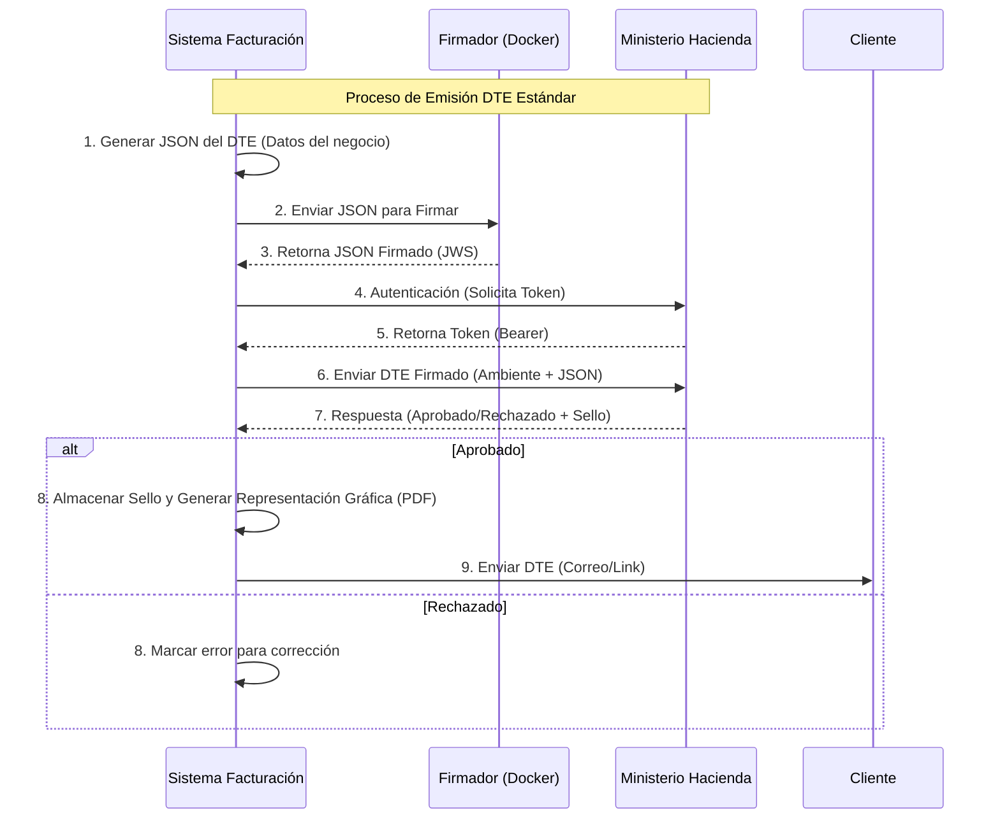

# Análisis de Preparación del Proyecto y Flujos DTE

Fecha: 14 de Diciembre de 2025
Proyecto: WavePos DTE-v2

## 1. Resumen Ejecutivo de Preparación

Tras revisar la documentación en `Doc_Actualizados_Implementacion_DTE` y el código fuente del proyecto, confirmamos que el sistema **está técnicamente listo** y alineado con los requisitos del Ministerio de Hacienda (MH) para la emisión de Documentos Tributarios Electrónicos (DTE).

El proyecto cumple con la estructura requerida en el "Manual Técnico para la Integración Tecnológica del Sistema de Transmisión".

### Puntos Clave Verificados:
-   **Generación de JSON (`dte-builder.js`)**: El código construye correctamente los documentos JSON siguiendo los esquemas oficiales (versiones 1 y 3).
-   **Catálogos V 1.2**: La base de datos `wavepos_dte_v2` ya contiene los 32 catálogos actualizados requeridos para evitar rechazos por códigos inválidos.
-   **Firma Electrónica (`dte-signer.js`)**: El servicio está configurado para consumir el firmador del MH corriendo localmente en Docker (`localhost:8080`), cumpliendo con el estándar de seguridad.
-   **Conexión API MH (`dte-api.service.js`)**: El flujo de autenticación (OAuth2) y transmisión (`/recepcion`) sigue estrictamente las especificaciones del MH.

---

## 2. Diagramas de Flujo

A continuación se presentan los diagramas comparativos entre el flujo teórico exigido y el flujo implementado.

### 2.1 Flujo Normal (Estándar Ministerio de Hacienda)

Este diagrama representa el proceso ideal descrito en la documentación oficial.

### 2.2 Flujo Actual Implementado en WavePos

Este diagrama muestra cómo está construido el código actual. El flujo es **idéntico al estándar**, lo que garantiza el cumplimiento.

sequenceDiagram
    participant App as Backend WavePos
    participant DB as PostgreSQL
    participant Builder as DteBuilder (Servicio)
    participant Signer as Docker Firmador (Local)
    participant API as DteApiService
    participant MH as API Hacienda (Tenet/Prod)

    Note over App, MH: Implementación WavePos DTE-v2 (Multi-Empresa)

    App->>DB: Consultar Config Empresa (Credenciales MH, Certificado)
    DB-->>App: Retorna Configuración

    App->>Builder: buildFactura/CreditoFiscal(datos, config)
    Builder->>App: Retorna Objeto DTE Estándar

    App->>Signer: POST /firmar (JSON + Certificado)
    Signer-->>App: Retorna JSON Firmado (String)

    App->>API: enviarDte(JSON Firmado, Credenciales Empresa)
    API->>MH: POST /oauth2/token (Login con Credenciales de DB)
    MH-->>API: Token Acceso (Bearer)
    
    API->>MH: POST /recepcion (Payload con JSON Firmado)
    MH-->>API: Respuesta { estado: "PROCESADO", selloRecibido: "..." }
    
    API->>DB: INSERT INTO documento_*(estado, sello...)
    API-->>App: Resultado { success: true, estado: ... }

---

## 3. Conclusión y Recomendaciones

El proyecto tiene una estructura sólida y preparada para operar.

### Pasos Operativos Inmediatos:
1.  **Docker Firmador**: Asegurarse que el contenedor de Docker proporcionado por el MH esté ejecutándose en la máquina servidor en el puerto `8080`.
2.  **Variables de Entorno**: Verificar que el archivo `.env` contenga las credenciales de producción/pruebas correctas (`MH_USER`, `MH_PWD`, `MH_NIT`, `DTE_SIGNER_PASSWORD`).
3.  **Certificado**: El firmador en Docker debe tener cargado el certificado `.p12` válido del contribuyente.

El sistema está listo para iniciar pruebas de transmisión reales.
