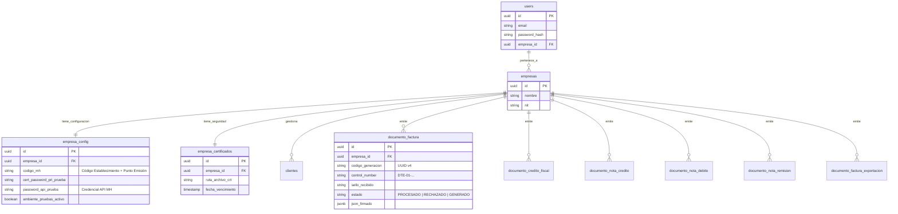

# Documentación de Arquitectura de Datos DTE

## Diagrama Entidad-Relación (ERD)

Este diagrama refleja la estructura actual de la base de datos PostgreSQL, diseñada para soportar múltiples empresas (Multi-Tenant) con configuraciones y certificados independientes, y almacenamiento especializado por tipo de documento.

## Flujo de Autenticación y Cambio de Contexto

1.  **Login**: Usuario ingresa credenciales -> Servidor valida -> Retorna JWT con `empresaId`.
2.  **Operación**: Cada petición valida el JWT y extrae `empresaId` para asegurar que el usuario solo opere sobre su empresa.
3.  **Cambio de Empresa**: Si el usuario cambia de empresa o crea una nueva:
    *   Backend actualiza `users.empresa_id`.
    *   Frontend llama a `POST /api/auth/refresh-token` para obtener un nuevo JWT con el nuevo `empresaId`.
    *   Siguientes peticiones usan el contexto actualizado automáticamente.
